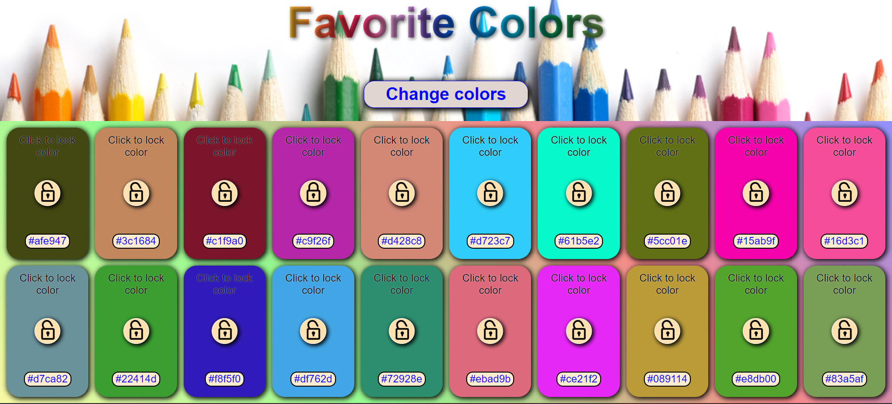
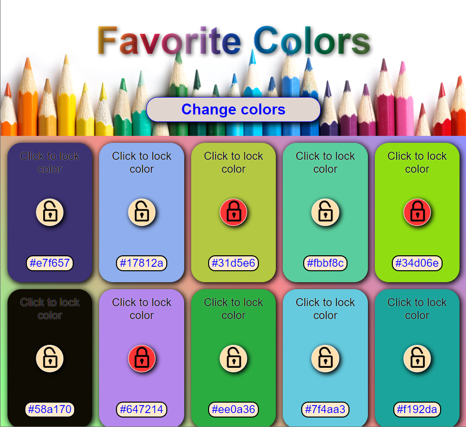

# Favorite colors

>You can choose the color you like and lock it so that it does not change and continue choosing

### Tech stack
* [X] **HTML**: This is the markup language used to create the structure and content of web pages. It is often used together with a JavaScript library to build user interfaces.
* [X] **CSS**: A fast and high-level web application development tool that matches the styling and appearance of web pages. It is used to determine the appearance and composition of elements.
* [X] **JS**: A fast and advanced web application development tool. It is a scripting programming language used to interact with custom elements and make web pages dynamic.
  
___ 

[Link to the site](https://rss-777.github.io/Favorite_Colors/)

___
### Screenshot

    
     

